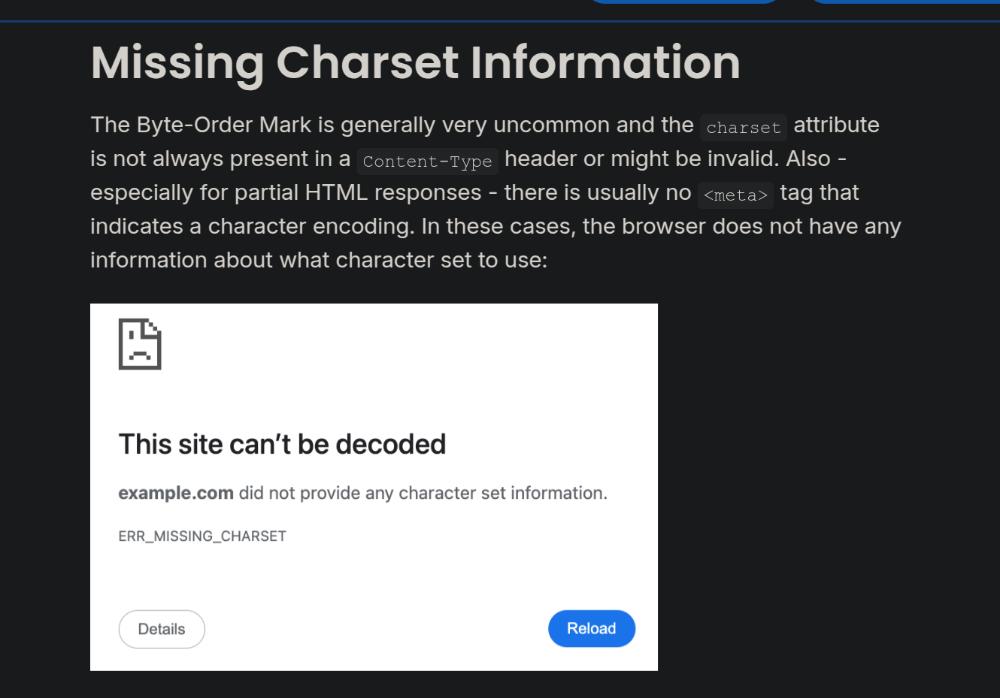

# Encoding differentials: Why charset matters

> [!Note]
> reference is found [here](https://www.sonarsource.com/blog/encoding-differentials-why-charset-matters/) (proper credit goes to their work)

I remember encountering a CTF challenge about the use of character sets in HTML documents. That's why I'm revisiting this.

## Introduction

When running `curl -s -I curl -I -s https://www.sonarsource.com/blog/encoding-differentials-why-charset-matters/ | grep -P ^content-type` We get the following:

Which is a normal response. Had the charset attribute been omitted, the article claims that it's vulnerable, more specifically, the browser doesn't know what to do.

> [!TIP]
> find details for this in `./missing-charset-info`

After you've checked the details, we know that **auto-detection feature is very powerful.**

## How could attackers exploit this?

