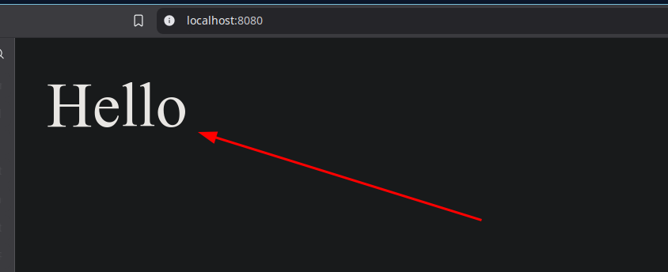

Missing character information, better known as `ERR_MISSING_CHARSET` doesn't exist!


I tried reproduce the issue using:

```bash
➜ echo -ne "HTTP/1.1 200 OK\r\n\r\n<html><body>Hello</body></html>" | nc -l -p 8080
```

Which actually returned hello normally.


